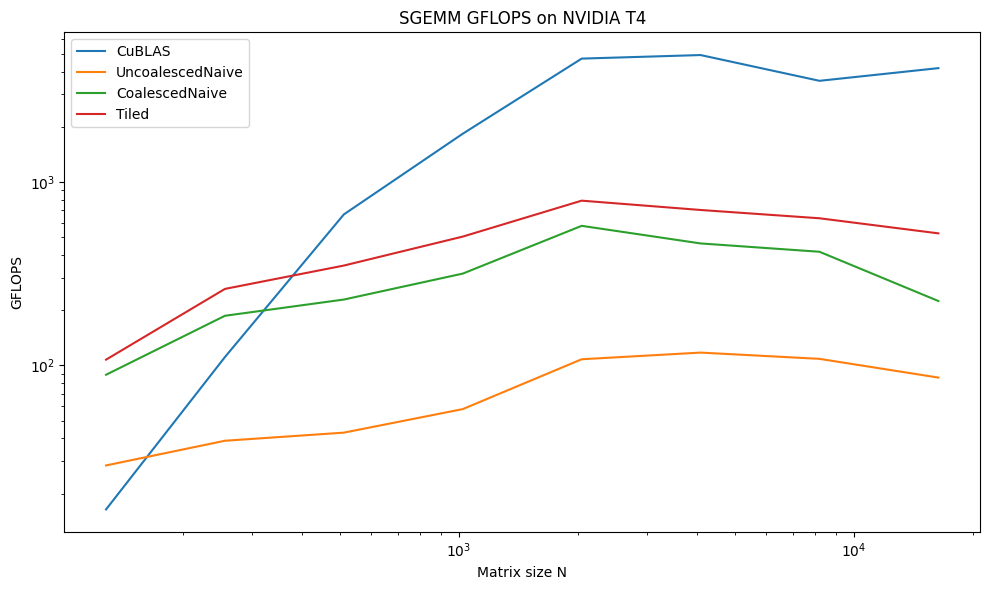

# CUDA SGEMM Benchmark

This project allows you to benchmark different implementations of single-precision general matrix-matrix multiplication (SGEMM) on your own NVIDIA GPU using CUDA. You can test naive, coalesced, tiled, register-tiled, and cuBLAS kernels and see how performance scales with matrix size.

## Features

- Multiple SGEMM implementations:
  - **Uncoalesced Naive** — simple row-column multiplication.
  - **Coalesced Naive** — optimized memory access.
  - **Tiled (shared memory)** — block-level tiling for higher reuse.
  - **Register-Tiled** — per-thread register tiling.
  - **cuBLAS** — NVIDIA’s optimized library.
- Accurate GPU timing with CudaTimer.
- Results exported to CSV for plotting and analysis.
- Compute performance in **GFLOPS**.

## Requirements

- NVIDIA GPU with CUDA support.
- CUDA Toolkit installed.
- C++17 compatible compiler.
- Python 3 (for plotting results).

## Building

```bash
# Clone repository
git clone https://github.com/syrianigabriel/cuda-sgemm.git
cd cuda-sgemm
```

Now, make sure to set -arch=sm_XX in the Makefile to match your GPU’s compute capability (use nvidia-smi to check). Then,

```bash
# Build with make
make
```

## Running Benchmarks

You can run benchmarks for a specific matrix size and number of runs:

```bash
./sgemm <matrix_size> [num_runs]
```

- `<matrix_size>` — dimension N for NxN matrices.  
- `[num_runs]` — optional, number of repetitions for averaging.

**Tip:**
To test multiple sizes at once, edit `scripts/run_benchmarks.sh` and modify the `sizes=(...)` array.

## Output

The program prints a CSV line:

```
N,CuBLAS,UncoalescedNaive,CoalescedNaive,Tiled
```

- Each value is the average kernel execution time in milliseconds.  
- You can redirect output to a CSV file:

```bash
./sgemm 1024 5 >> results/t4/sgemm.csv
```

## Sample Results on NVIDIA T4 (Time in ms)

The table below shows the execution time in **milliseconds** for different SGEMM implementations on a NVIDIA T4 GPU. Matrix size `N` varies from 128 to 16384.

<div align="center">

|   N   | CuBLAS | UncoalescedNaive | CoalescedNaive | Tiled | RegisterTiled |
|:-----:|:------:|:----------------:|:--------------:|:-----:|:-------------:|
| 128   | 0.39184 | 0.158746 | 0.0564032 | 0.0513024 | 0.0390528 |
| 256   | 0.299091 | 0.865568 | 0.178816 | 0.126118 | 0.0794368 |
| 512   | 0.375008 | 6.23804 | 1.17023 | 0.76311 | 0.424973 |
| 1024  | 1.26228 | 43.1346 | 8.1543 | 4.94571 | 2.26589 |
| 2048  | 3.72529 | 158.281 | 30.2711 | 22.0071 | 12.2827 |
| 4096  | 28.0095 | 1169.81 | 295.442 | 198.31 | 100.791 |
| 8192  | 322.457 | 10131.6 | 2661.33 | 1737.64 | 841.347 |
| 16384 | 2458.06 | 102501 | 39313.8 | 16691.8 | 7731.36 |

</div>

The chart below shows the corresponding **GFLOPS** achieved by each implementation. This highlights how performance scales with matrix size, with CuBLAS reaching its peak throughput for larger matrices due to reduced overhead and better kernel optimization.



